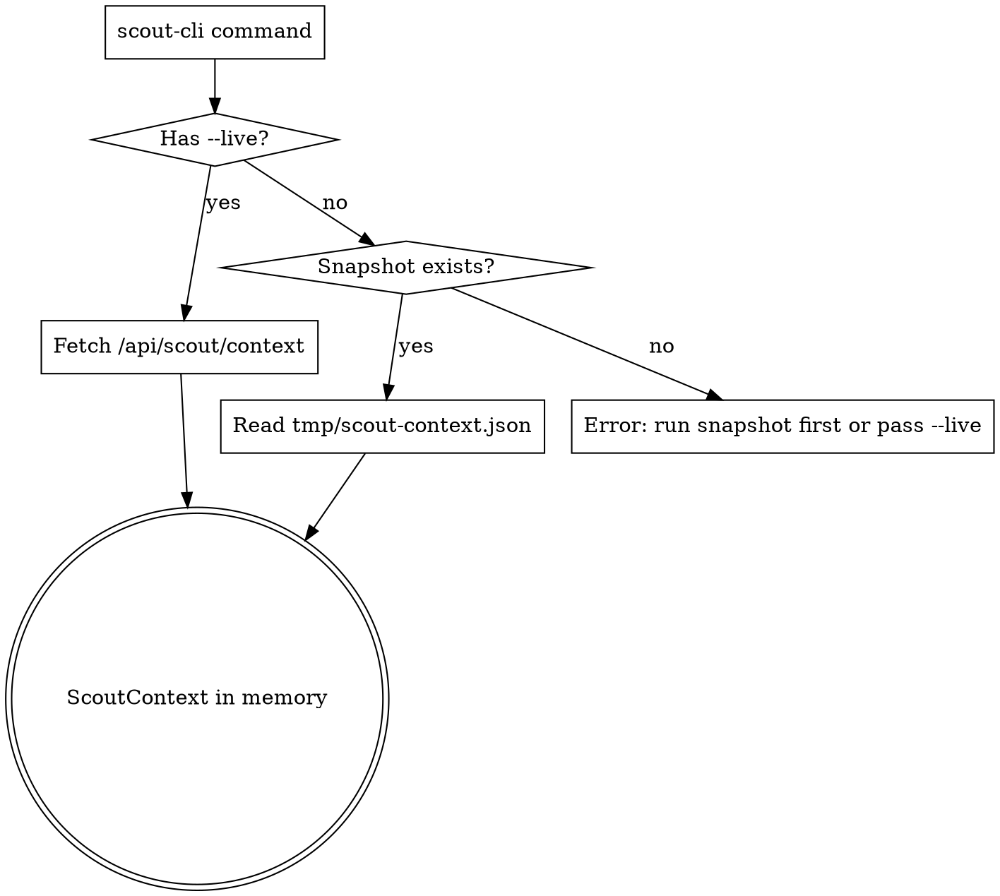

# Scout CLI Debug Tool

**Date:** 2026-04-14
**Status:** Design approved, awaiting plan
**Primary user:** Claude (the assistant), debugging the scout algorithm without leaving the terminal

## Goal

Provide a thin Node CLI that lets the assistant invoke any phase of the scout algorithm (or the whole pipeline) directly from the shell, with controlled inputs and machine-readable JSON output. The point is to remove the boilerplate of constructing browser context or reading through worker code every time a question comes up about why a comp scored a certain way, why a champion was filtered out, or what `buildTeamInsights` returns for a given team.

Secondary user: the human owner, who can use the same tool for ad-hoc investigation alongside the existing browser UI.

## Background

The scout algorithm lives in `resources/js/workers/scout/` as pure TypeScript modules with no DB access. Today the only way to exercise it is through the React `Scout` page, which means: start dev server, open browser, click around, read DevTools. That is fine for visual smoke checks but terrible for "run this exact input and show me the breakdown."

All worker modules are pure functions. `engine.ts:generate` orchestrates them in this order:

1. `buildHeroExclusionGroup(champions)`
2. `filterCandidates(champions, constraints, exclusionGroups)` → candidates
3. `getLockedChampions(...)` → locked
4. `buildGraph(eligible, traits, scoringCtx, exclusionLookup)` → graph
5. `findTeams(graph, opts)` → rawTeams
6. per team: `buildActiveTraits` + `teamScore` + `teamScoreBreakdown` + `teamRoleBalance`
7. `validComps` filter (slot budget + trait locks + role filter)
8. meta-match annotation against `scoringCtx.metaComps`
9. `buildTeamInsights` per team
10. sort by score desc + slice top-N

The `ScoutContext` (champions, traits, scoringCtx, exclusionGroups, stale) is served by `ScoutController::context` at `GET /api/scout/context` and is roughly an MB of JSON.

## Architecture

A single Node CLI script in `scripts/scout-cli.ts`, invoked through `tsx` so the worker `.ts` modules can be imported directly without a build step. The CLI is a thin dispatcher: it parses argv, loads context, calls the requested worker function, and prints JSON. It contains no algorithm logic of its own.

```
scripts/
  scout-cli.ts                 entry point — argv parsing + command dispatch
  scout-cli/
    context.ts                 snapshot load/save + live fetch
    format.ts                  smart-summary formatters per command
    commands/
      snapshot.ts              scout-cli snapshot
      context.ts               scout-cli context
      generate.ts              scout-cli generate
      phase.ts                 scout-cli phase <phase-name>
```

Worker modules are imported via relative paths:

```ts
import { generate } from '../resources/js/workers/scout/engine';
import { buildGraph, findTeams } from '../resources/js/workers/scout/synergy-graph';
// ...etc
```

`engine.ts` carries `// @ts-nocheck`, so `tsx` will load it as effectively-JS without complaining.

## Dependencies

Add to `devDependencies`:

- `tsx` — runs `.ts` files directly under Node, the simplest available option (vite-node would require config plumbing; bare `node --loader` is finicky on Windows). One small dep.

That is it. The CLI uses `node:fs`, `node:path`, `node:process`, and global `fetch` (Node 18+).

Add an npm script in `package.json`:

```json
"scripts": {
  "scout": "tsx scripts/scout-cli.ts"
}
```

So invocation becomes `npm run scout -- <command> [...flags]`.

Add `tmp/` to `.gitignore` (or `tmp/scout-context.json` specifically) so the snapshot never gets committed.

## Commands

```
npm run scout -- snapshot                        Fetch /api/scout/context → tmp/scout-context.json
npm run scout -- snapshot --inspect              Show meta (counts, stale, syncedAt) without writing

npm run scout -- context                         Show meta of the saved snapshot
npm run scout -- context --champion Aatrox       Dump one champion record
npm run scout -- context --trait Vanguard        Dump one trait record

npm run scout -- generate [common flags]         End-to-end generate(), smart summary
npm run scout -- generate --full                 Full JSON dump (no summary)

npm run scout -- phase candidates [common flags]
npm run scout -- phase graph [common flags]
npm run scout -- phase find-teams [common flags]
npm run scout -- phase score --team A,B,C,...
npm run scout -- phase active-traits --team A,B
npm run scout -- phase role-balance --team A,B
npm run scout -- phase insights --team A,B
```

### Common flags

Flags that reproduce the most common `ScoutParams` fields, plus the new `min-frontline` / `min-dps` filters from the just-shipped role-filters feature:

| Flag | Type | Default | Notes |
|---|---|---|---|
| `--level N` | int | `8` | |
| `--top-n N` | int | `10` | |
| `--max-5cost N` | int or omitted | `null` | |
| `--min-frontline N` | int | `0` | |
| `--min-dps N` | int | `0` | |
| `--locked A,B,C` | csv apiNames | `[]` | Locked champions |
| `--excluded A,B,C` | csv apiNames | `[]` | |
| `--locked-trait Vanguard:4,Gunner:3` | csv `apiName:minUnits` | `[]` | |
| `--emblem Vanguard:1,Gunner:2` | csv `apiName:count` | `[]` | |
| `--seed N` | int | `0` | |
| `--params file.json` | path | none | Full `ScoutParams` JSON; merges over flags (file wins) |
| `--raw-input file.json` | path | none | Per-phase escape hatch — skip auto-build, pass exact phase input |
| `--full` | bool | `false` | Disable smart-summary formatting |
| `--live` | bool | `false` | Skip snapshot, fetch context fresh |
| `--snapshot path.json` | path | `tmp/scout-context.json` | Override snapshot location |

`--team` (used by per-team phase commands) is a CSV of champion `apiName`s. Order matters only insofar as the worker preserves it.

### Per-phase auto-build

The "phase" subcommands by default run the upstream pipeline up to the requested phase, using the loaded context and the common flags, so the assistant does not have to construct intermediate state by hand:

- `phase candidates` → just runs `filterCandidates(champions, constraints, exclusionGroups)`. No upstream needed.
- `phase graph` → runs candidates + locked + `buildGraph(...)` and prints graph meta.
- `phase find-teams` → runs everything up to and including `findTeams(...)`, prints `rawTeams`.
- `phase score`, `phase active-traits`, `phase role-balance`, `phase insights` → take a `--team CSV`, look up each champion in the loaded context, build the team object that the worker expects, then call the requested function. `phase score` additionally calls `buildActiveTraits` first because the scorer needs it.

`--raw-input file.json` overrides the auto-build entirely. Whatever JSON is in the file becomes the direct argument to the phase function. Use case: capture the exact intermediate state from a failing run, save it, replay it.

## Context loading



The fetch URL base comes from `process.env.SCOUT_API_BASE`, defaulting to `http://localhost`. Path is always `/api/scout/context`.

The snapshot file format is whatever `/api/scout/context` returns, written verbatim. No transformation, no schema gymnastics. If the API shape changes, the snapshot becomes stale and the user re-runs `snapshot`.

`snapshot --inspect` does the fetch but prints meta to stdout and exits without touching disk. Use case: "what is currently in the live context right now?" without disturbing the saved baseline.

## Output format

Default for every command: pretty JSON, 2-space indent, to stdout. Errors go to stderr with exit code 1.

Smart summaries are designed to be **token-efficient for the assistant** — every field is one the assistant would otherwise have to dig out manually.

### `generate` summary

```jsonc
{
  "topN": 10,
  "results": [
    {
      "rank": 1,
      "score": 87.34,
      "champions": ["Aatrox", "MissFortune", "Jinx", "Senna", "Garen", "Lux", "Ahri", "Yone"],
      "activeTraits": "Vanguard:4(Gold) Gunner:3(Silver) Sniper:2(Bronze)",
      "roles": "fl:3 dps:4 fighter:1",
      "slotsUsed": 8,
      "metaMatch": "TF Reroll(80%)",
      "breakdown": {"unit": 42.1, "trait": 28.5, "balance": -3.0, "...": "..."}
    }
  ],
  "filtered": {
    "rawTeams": 150,
    "enriched": 150,
    "afterValidComps": 87,
    "afterTopN": 10
  }
}
```

`activeTraits` is rendered as a single space-separated string `apiName:count(style)` so a 10-trait comp does not blow out the JSON. `metaMatch` is `null` when the team did not match any meta comp. `breakdown` keys come straight from `teamScoreBreakdown` and are rounded to one decimal.

`--full` disables every formatter and prints the literal return value of `generate(...)`.

### Per-phase summaries

| Command | Smart summary shape |
|---|---|
| `phase candidates` | `{ count, byCost: {1: n, 2: n, ...}, byTrait: {Vanguard: n, ...}, sample: ["Aatrox", ...] }` |
| `phase graph` | `{ nodes, edges, avgDegree, sampleEdges: [["Aatrox","MissFortune"], ...] }` |
| `phase find-teams` | `[ { champions: [...apiNames], teamSize, slotsUsed }, ... ]` |
| `phase score` | `{ score, breakdown }` |
| `phase active-traits` | `[ { apiName, count, style, breakpoint }, ... ]` |
| `phase role-balance` | `{ frontline, dps, fighter, effectiveFrontline, effectiveDps }` |
| `phase insights` | The `TeamInsights` object as-is — it is already small |

`--full` everywhere prints the raw return value of the underlying worker function.

### `context` command

```jsonc
{
  "champions": 60,
  "traits": 28,
  "exclusionGroups": 4,
  "scoringCtx": {
    "unitRatings": 60,
    "traitRatings": 28,
    "metaComps": 12,
    "syncedAt": "2026-04-13T22:11:04Z",
    "stale": false
  }
}
```

`--champion <apiName>` and `--trait <apiName>` print the matching record verbatim from the loaded context (full object).

## Edge cases

- **Missing snapshot, no --live.** Print to stderr: `No snapshot at tmp/scout-context.json. Run \`npm run scout -- snapshot\` or pass --live.` Exit 1.
- **Live fetch fails.** Print the HTTP status and URL to stderr. Exit 1. Do not fall back to a stale snapshot silently — the assistant needs to know which mode it is in.
- **Champion apiName not found** (e.g. typo in `--locked` or `--team`). Print the bad name plus the three nearest matches by case-insensitive substring or Levenshtein. Exit 1. Do not silently drop unknown names.
- **Phase command without required flags** (e.g. `phase score` without `--team`). Print usage for that specific phase. Exit 1.
- **`--params file.json` and individual flags both present.** File wins. The file's JSON is parsed, then individual flag values are written into it only for keys the file did not specify. Document this precedence in `--help`.
- **`--raw-input file.json` and other flags both present.** Raw input wins entirely — flags and auto-build are skipped. Print a one-line warning to stderr if conflicting flags were also supplied, but proceed.
- **Snapshot file is malformed JSON.** Print path + parse error. Exit 1. Suggest re-running `snapshot`.
- **Worker function throws.** Catch, print stack trace to stderr, exit 1. Do not swallow.

## Testing strategy

Verification is manual, executed by the assistant after implementation:

1. `npm run scout -- snapshot` (Herd must be running). Confirm `tmp/scout-context.json` is written and non-empty.
2. `npm run scout -- context` — confirm meta counts look reasonable (champions > 30, traits > 10).
3. `npm run scout -- context --champion Aatrox` — confirm the champion record is dumped.
4. `npm run scout -- generate` — confirm `results` is non-empty and `filtered.afterTopN === results.length`.
5. `npm run scout -- generate --min-frontline 4` — confirm every result satisfies `roles.frontline + 0.5 * roles.fighter >= 4`.
6. `npm run scout -- phase candidates` — confirm `count > 0`.
7. `npm run scout -- phase score --team <8 valid champion apiNames>` — confirm a numeric `score`.
8. `npm run scout -- phase find-teams` — confirm at least one team in the result.
9. Error paths: `npm run scout -- phase score --team Foo,Bar` — confirm the unknown-name error fires.
10. `--live` parity: `npm run scout -- generate --live` produces output identical in shape to the snapshot version (scores may differ if MetaTFT data has refreshed).

No unit tests. The CLI is a thin shell over already-existing pure functions; the surface area worth testing is the worker itself, which has its own (separate) verification path.

## Out of scope

- Watch mode / REPL.
- Pretty-printed (non-JSON) human-readable output. Smart summaries are still JSON.
- Persisting test cases ("save this --team as a fixture and replay it"). The assistant can save inputs to files and pass them via `--params` / `--raw-input` already.
- Modifying any worker code. The CLI imports and calls; it does not change the algorithm.
- A second fixture format. The snapshot file IS the fixture.
- Auth / multi-user concerns. This is a local debug tool.
