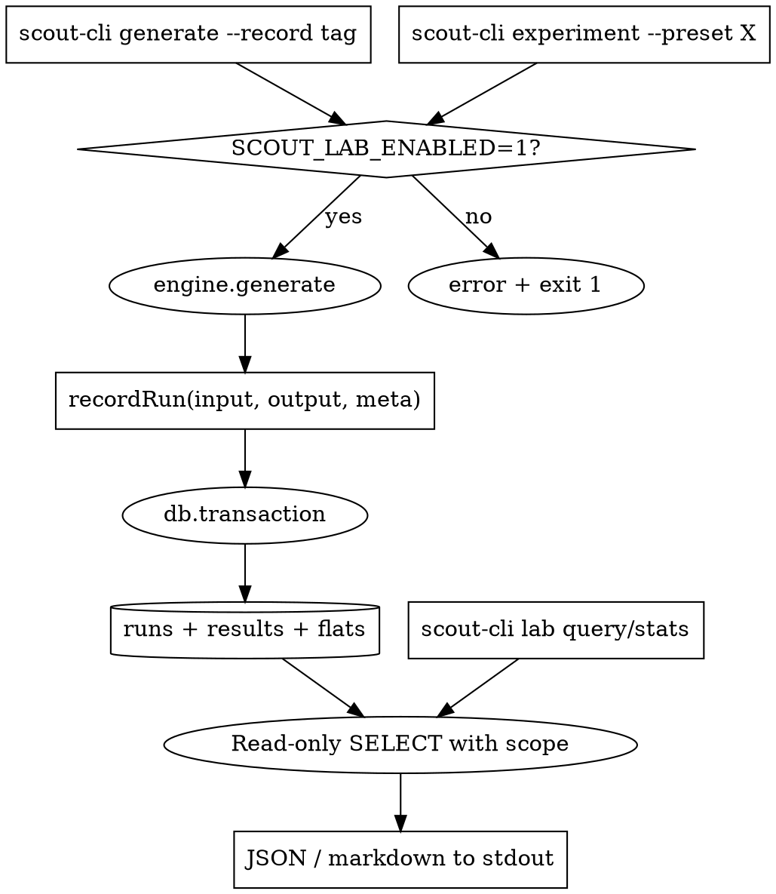

# Scout Lab — Sidecar Data Collection & Analysis

**Date:** 2026-04-14
**Status:** Design approved, awaiting plan
**Primary user:** Claude (the assistant), analysing algorithm behaviour across many runs
**Secondary user:** Human owner, asking the assistant questions that the assistant answers from the data

## Goal

Give the assistant a local data layer that captures scout algorithm inputs and outputs across many runs so that bias, regressions, and edge cases become visible through aggregate queries rather than one-off manual inspection. The layer is a sidecar — it lives next to the main application but never touches the Laravel stack, the Postgres database, the UI, or production.

No user interface is built in this project. Every interaction happens through the existing `scout-cli` plus a few new subcommands. The assistant answers the human's questions by running queries and presenting the results as markdown tables in chat. If the human wants to inspect the raw SQLite file directly, any local SQLite viewer works.

## Background

The scout worker (`resources/js/workers/scout/`) runs as pure functions, and the `scout-cli` built in the earlier spec (`2026-04-14-scout-cli-debug-tool-design.md`) already exposes every phase for interactive debugging. That tool is great for "what happens on this one input". It is bad for "across the last 500 runs, which champions show up in rank 1 most often, and which never appear". That is the gap this spec fills.

The scout algorithm lives in TypeScript with zero DB dependencies, so we can freely ingest its outputs from any Node process. The main app runs on Postgres; adding any analytics tables there would pollute a clean schema and couple the UI request path to ingest code. Isolation is mandatory.

## Architecture

A single new directory `scripts/scout-cli/lab/` holds everything: SQLite connection, ingester, experiment runner, query helpers, and command handlers. A new npm dep `better-sqlite3` (synchronous, bundled binaries, zero config) owns the file at `tmp/scout-lab/runs.db`, which is already ignored by the existing `/tmp` rule in `.gitignore`.

The existing `scout-cli.ts` dispatcher gains three command branches:
- `experiment` — bulk runner
- `lab` — umbrella for `init`, `query`, `stats`, `doctor`, `prune`
- (implicit) the existing `generate` and `phase` commands grow a shared `--record <tag>` flag handled in `params.ts`

The Laravel stack is not touched. The React worker is not touched. The Postgres schema is not touched. Every import chain starts from `scripts/scout-cli.ts` and terminates in worker modules that the CLI already imports today.

```
scripts/
  scout-cli.ts                 (modified — two new dispatch branches)
  scout-cli/
    context.ts, lookup.ts,     (unchanged)
    params.ts,
    format.ts,
    commands/
      generate.ts              (modified — pass-through --record to recordRun)
      phase.ts                 (modified — same)
      experiment.ts            NEW — bulk matrix / preset runner
      lab.ts                   NEW — lab subcommand dispatcher (init/query/stats/doctor/prune)
    lab/                       NEW
      db.ts                    connection, WAL pragma, schema init, version check
      schema.sql               CREATE TABLE statements, applied by db.ts on init
      ingest.ts                recordRun(input, output, meta) — single call point
      experiment.ts            matrix expansion, preset loading, run loop
      presets.ts               named experiment presets as TypeScript consts
      queries.ts               named stats SQL + markdown formatters
      hash.ts                  normalised params → sha256 hex
      git.ts                   git SHA capture via node:child_process.execFile
tmp/
  scout-lab/
    runs.db                    (created by `lab init`, gitignored via /tmp)
```

## Dependency & environment

Add `better-sqlite3` to `devDependencies`. Rationale: synchronous API fits the CLI's flow (no async plumbing), prebuilt binaries ship for Win/macOS/Linux so no native compilation, and WAL mode gives concurrent reads while `recordRun` is writing.

Introduce one environment variable:

```
SCOUT_LAB_ENABLED=1
```

Semantics:

- **Unset or any value other than `1`** → `recordRun` is a guaranteed no-op; any `lab ...` or `experiment` command exits with a clean error and hint; the `--record` flag errors before doing work.
- **Set to `1`** → full behaviour enabled.

This is fail-closed: a forgotten flag causes commands to refuse, never silent data collection. The CLI is Node-only and never runs on prod, but the same guard ensures the assistant cannot accidentally fill the DB with noise during unrelated debugging either.

## Schema

Version 1. Migrations are explicitly out of scope; if we need v2, a separate spec covers it.

```sql
CREATE TABLE runs (
  id                 INTEGER PRIMARY KEY AUTOINCREMENT,
  ts                 TEXT NOT NULL,
  source             TEXT NOT NULL,          -- 'cli' | 'experiment' | 'phase'
  command            TEXT NOT NULL,          -- 'generate' | 'phase:score' | ...
  tag                TEXT,                   -- user label, nullable
  experiment_id      TEXT,                   -- groups runs from one `experiment` invocation
  git_sha            TEXT,                   -- git rev-parse HEAD at run time
  duration_ms        INTEGER,
  level              INTEGER,
  top_n              INTEGER,
  seed               INTEGER,
  min_frontline      INTEGER,
  min_dps            INTEGER,
  max_5cost          INTEGER,                -- nullable
  locked_json        TEXT,                   -- JSON array of apiNames
  excluded_json      TEXT,                   -- JSON array
  locked_traits_json TEXT,                   -- JSON array of {apiName,minUnits}
  emblems_json       TEXT,                   -- JSON array of {apiName,count}
  params_hash        TEXT NOT NULL,          -- sha256 of normalised full params
  result_count       INTEGER NOT NULL,
  filtered_json      TEXT,                   -- {rawTeams,enriched,afterValidComps,afterTopN}
  notes              TEXT
);
CREATE INDEX idx_runs_ts ON runs(ts);
CREATE INDEX idx_runs_tag ON runs(tag);
CREATE INDEX idx_runs_exp ON runs(experiment_id);
CREATE INDEX idx_runs_hash ON runs(params_hash);

CREATE TABLE results (
  id                 INTEGER PRIMARY KEY AUTOINCREMENT,
  run_id             INTEGER NOT NULL REFERENCES runs(id) ON DELETE CASCADE,
  rank               INTEGER NOT NULL,
  score              REAL NOT NULL,
  slots_used         INTEGER,
  champions_json     TEXT NOT NULL,           -- JSON array of {apiName, cost}
  active_traits_json TEXT NOT NULL,           -- JSON array of {apiName, count, style}
  roles_json         TEXT,
  breakdown_json     TEXT,
  meta_match_json    TEXT
);
CREATE INDEX idx_results_run ON results(run_id);
CREATE INDEX idx_results_score ON results(score);

CREATE TABLE champion_appearances (
  run_id    INTEGER NOT NULL REFERENCES runs(id) ON DELETE CASCADE,
  result_id INTEGER NOT NULL REFERENCES results(id) ON DELETE CASCADE,
  rank      INTEGER NOT NULL,
  api_name  TEXT NOT NULL,
  cost      INTEGER NOT NULL
);
CREATE INDEX idx_champ_app_api ON champion_appearances(api_name);
CREATE INDEX idx_champ_app_run ON champion_appearances(run_id);

CREATE TABLE trait_appearances (
  run_id    INTEGER NOT NULL REFERENCES runs(id) ON DELETE CASCADE,
  result_id INTEGER NOT NULL REFERENCES results(id) ON DELETE CASCADE,
  rank      INTEGER NOT NULL,
  api_name  TEXT NOT NULL,
  count     INTEGER NOT NULL,
  style     TEXT
);
CREATE INDEX idx_trait_app_api ON trait_appearances(api_name);
CREATE INDEX idx_trait_app_run ON trait_appearances(run_id);

CREATE TABLE breakdown_components (
  run_id    INTEGER NOT NULL REFERENCES runs(id) ON DELETE CASCADE,
  result_id INTEGER NOT NULL REFERENCES results(id) ON DELETE CASCADE,
  rank      INTEGER NOT NULL,
  component TEXT NOT NULL,            -- 'champions'|'traits'|'affinity'|...
  value     REAL NOT NULL
);
CREATE INDEX idx_bd_comp ON breakdown_components(component);
CREATE INDEX idx_bd_run ON breakdown_components(run_id);

CREATE TABLE schema_version (version INTEGER PRIMARY KEY);
INSERT INTO schema_version VALUES (1);
```

`runs` is the source of truth for inputs; `results` is the source of truth for outputs; the three flat appearance tables are denormalised caches populated atomically from each result, so aggregate queries are a single scan without JSON parsing. The dedup guard uses `params_hash` and is optional.

## Ingestion

Two entry points, both in `scripts/scout-cli/`:

**Ad-hoc capture via `--record <tag>`** — shared flag on `generate` and `phase` commands, parsed in `params.ts`. When `SCOUT_LAB_ENABLED=1` and `tag != null`, the command wraps its normal `generate()` or phase call, measures duration, and calls `recordRun(input, output, {source: 'cli', command, tag, git_sha})` before printing. When the flag is used without the env, the command exits 1 with `--record requires SCOUT_LAB_ENABLED=1`. When the flag is absent, behaviour is identical to today — no ingest overhead whatsoever.

**Bulk experiment runner via `scout-cli experiment`** — a new top-level command. Three mutually-compatible modes:

```
--preset <name>             Load matrix from presets.ts by name
--matrix '<json>'           Inline matrix, e.g. {"level":[7,8,9],"minFrontline":[0,2,4]}
--repeat N --seed-range A-B Single input repeated N times with incrementing seed
```

The runner expands matrix × repeat into a flat list of concrete param sets, generates a single `experiment_id` (UUIDv4) for the whole invocation, and runs each set through `engine.generate`. Each result is recorded with `source='experiment'`, shared `experiment_id`, and an optional `--tag` label. Progress goes to stderr, final summary `{experiment_id, runs, total_ms, dedup_skipped}` goes to stdout as JSON.

Dedup is **opt-in** via `--dedupe`. Grid search usually wants every run recorded even if params repeat, because downstream queries care about sample counts.

`recordRun` runs every insert for a single run inside one `db.transaction(...)` to keep writes atomic. Git SHA is captured once per process start via `node:child_process`'s `execFile` helper (never `exec` — no shell, one fixed argv) and cached in-module so the same SHA is reused across all runs in an experiment.

## Stale-data contamination — the default scoping rule

This is the part that matters for "old data vs new data during an active debug session". Without a default scope, `lab stats top-champions` would aggregate over everything in the DB — including runs from an older algorithm version that are no longer relevant and would bias the numbers.

**Default scope for every `stats` and `query` command:**

- **`stats`** defaults to `--last 500` runs by `ts`. To look at the whole history, pass `--all` explicitly. To look at a specific session, pass `--experiment <id>` or `--tag <label>`.
- **`query`** has no default scope (it is raw SQL), but the skill file tells the assistant to always start ad-hoc queries with an explicit `WHERE run_id IN (SELECT id FROM runs WHERE ...)` clause — and stats uses that same pattern internally so the assistant has a template to copy.
- **`lab doctor`** always prints: total runs, oldest `ts`, newest `ts`, unique git SHAs, and a warning if the git SHA of the newest run differs from the current working tree SHA ("the most recent recorded run was against a different algorithm revision than HEAD"). This is how I notice the DB is stale before running aggregations.

**Assistant workflow convention** (enforced by the skill file, not by code):

1. Start a debug session → decide whether the existing DB is useful or not.
2. If the existing DB is from a different algorithm SHA → either `lab prune --all --yes` or tag the session with `--tag session-<date>` and scope all subsequent analysis to that tag.
3. For experiments that should be self-contained, always use `experiment` (which gets its own `experiment_id`) and pass `--experiment <id>` to every follow-up `stats`/`query` call.
4. Only fall back to `--all` when you explicitly want cross-session aggregates.

**Fresh-start helper: `scout-cli lab reset`** — convenience wrapper around `lab prune --all --yes` followed by `lab init`. Zero-argument, prints one-line confirmation. Meant for "I am starting a new analysis session from scratch, wipe the slate."

## Query layer

**Raw SQL (`scout-cli lab query '<sql>'`):**

The single-argument form takes one SQL string. Executes read-only (`db.pragma('query_only = ON')` set before every query command), so a typo cannot wipe data. Prints `{columns, rows}` pretty JSON to stdout by default. Flags:

- `--csv` emits CSV instead
- `--limit N` caps rows at N (default 1000) before stringifying

Primary use case: me running arbitrary ad-hoc aggregations through `ctx_execute` without worrying about context bloat.

**Predefined stats (`scout-cli lab stats [name]`):**

Named queries defined in `lab/queries.ts`. `stats` with no name lists all available with one-line descriptions. `stats <name>` runs the query and prints a markdown table (cheap to embed in chat) plus a `--json` flag for raw shape.

All stats accept a shared scope argument set: `--experiment <id>`, `--tag <label>`, `--last N` (default 500), `--since <date>`, `--all` (opt-in to ignore the default 500 cap).

Version 1 query set (stored as a `StatQueries` const in `lab/queries.ts`):

| name | answers |
|---|---|
| `summary` | Total runs, results, time span, unique experiments, unique tags, git SHAs seen |
| `top-champions` | Top N champions by appearance count in top-1 within scope |
| `top-champions-by-rank` | Champion × rank matrix — who dominates rank 1 vs rank N |
| `dead-champions` | Champions never appearing in any recorded top-N within scope (bias alarm) |
| `top-traits` | Top N traits by total appearances across all ranks |
| `trait-dominance` | Trait × avg count × % of runs it was active |
| `breakdown-distribution` | Per-component min / median / max / stddev across all results |
| `score-by-filter` | Avg score and result-count grouped by (level, minFrontline, minDps) |
| `meta-match-rate` | Percentage of runs with `metaMatch`, avg similarity score |
| `role-balance-distribution` | Frequency distribution of fl/dps/fighter combos in top-1 |
| `experiment-diff` | Compare two `experiment_id`s — which champions/traits differ |
| `filter-breaking-points` | Matrix of (minFrontline, minDps) → avg `result_count` |

**Ingest health (`scout-cli lab doctor`):**

Prints the DB path, file size, row count per table, schema version, whether `SCOUT_LAB_ENABLED` is set, git SHA of the most recent run versus the current working-tree SHA, and the timestamp of the oldest and newest run. When the recorded SHA differs from the working tree, prints a yellow warning line. Exits 0 if DB is readable, 1 otherwise with a hint.

**Retention (`scout-cli lab prune`):**

Manual cleanup only — no auto-retention. Flags:

- `--older-than <duration>` — e.g. `30d`, `2w`, `6h`
- `--experiment <id>` — delete one experiment session
- `--tag <tag>` — delete everything with this tag
- `--sha <sha>` — delete everything recorded against a specific git SHA (useful after an algorithm change)
- `--all` — wipe the whole DB (requires `--yes` to skip the confirm prompt)

Every prune runs inside a transaction. Prints `{deleted: N}` to stdout.

**Reset (`scout-cli lab reset`):**

One-shot helper: `prune --all --yes` → `init`. For starting a clean analysis session in one command. Always asks for `--yes` unless piped non-interactively.

**Init (`scout-cli lab init`):**

Creates `tmp/scout-lab/runs.db` (and the parent directory via `mkdirSync recursive`), applies `schema.sql`, inserts schema version 1. Idempotent: if the DB already exists and is at v1, prints a confirmation and exits 0. If the DB exists but is at a different version, exits 1 with a migration hint.

## Data flow



## Edge cases

- **DB locked.** Not realistically reachable — `scout-cli` is the only writer. WAL mode allows concurrent readers anyway. `PRAGMA journal_mode=WAL; PRAGMA synchronous=NORMAL` set at connection time.
- **Missing DB on query or stats.** Clean error: `"DB not initialised. Run: npm run scout -- lab init"`. Exit 1.
- **Ingest crash mid-experiment.** Every run is its own transaction. Completed runs survive, the failing run rolls back, the runner logs the error to stderr and continues with the next combination.
- **Schema version mismatch.** `lab init` and `lab doctor` both compare `schema_version.version` against the current constant. Mismatch → exit 1 with hint. Migrations are future work.
- **Huge `--full` payloads.** Ingest writes JSON blobs into TEXT columns with no truncation. SQLite TEXT is bounded at ~1 GB, so a single run cannot hit the cap; a whole DB over 500 MB should prompt `lab prune`.
- **Hash dedup false positives.** `params_hash` is computed over explicitly-passed params, not the full `scoringCtx`. If MetaTFT data changes mid-experiment and scores drift, the same hash can represent different actual inputs. Default behaviour is no dedup; `--dedupe` is opt-in and documented with this caveat.
- **`SCOUT_LAB_ENABLED` unset + `--record` or `lab ...`.** Fast-fail with error message naming the env var. Never silent.
- **Git SHA capture fails** (no git binary, detached submodule, …). Store `git_sha = 'unknown'`, continue.
- **Stale data across algorithm revisions.** Handled by the default `--last 500` scope on `stats`, the SHA warning in `lab doctor`, and the `lab reset` helper. Assistant skill file instructs starting every new analysis session with either `lab reset` or an explicit `--experiment`/`--tag` scope.

## Testing

No unit tests — the project has no test runner configured, and every module is either a thin wrapper over `better-sqlite3` or a SQL string. Verification is manual, executed by the assistant after implementation:

1. `SCOUT_LAB_ENABLED=1 npm run scout -- lab init` → `tmp/scout-lab/runs.db` exists, `lab doctor` reports schema v1 and zero rows.
2. `SCOUT_LAB_ENABLED=1 SCOUT_API_BASE=https://tft-scout.test NODE_TLS_REJECT_UNAUTHORIZED=0 npm run scout -- generate --top-n 5 --record smoke` → non-zero row counts across `runs`, `results`, `champion_appearances`, `trait_appearances`, `breakdown_components`.
3. `SCOUT_LAB_ENABLED=1 npm run scout -- lab stats summary` → totals line up, default scope is last 500.
4. `SCOUT_LAB_ENABLED=1 npm run scout -- experiment --preset role-filter-sweep` → many runs share one `experiment_id`.
5. `SCOUT_LAB_ENABLED=1 npm run scout -- lab stats top-champions --experiment <id>` → non-empty markdown table.
6. `SCOUT_LAB_ENABLED=1 npm run scout -- lab query 'SELECT COUNT(*) FROM runs'` → single-cell JSON result.
7. `SCOUT_LAB_ENABLED=1 npm run scout -- lab prune --experiment <id>` → row counts drop.
8. `SCOUT_LAB_ENABLED=1 npm run scout -- lab reset` → DB cleared and re-initialised, `lab doctor` reports 0 rows.
9. Unset the env var, run any `lab ...` command → clean error, exit 1, no side-effects.

## Assistant skill

After implementation, add `.claude/skills/scout-lab/SKILL.md` (analogous to `scout-cli-debug`) so future sessions discover the tool. Contents:

- Required env (`SCOUT_LAB_ENABLED=1` + the existing Herd/cert env from `scout-cli-debug`)
- Workflow sequence: reset → init → record / experiment → query / stats
- All stat names with one-line descriptions (copy of the table above)
- Common ad-hoc query recipes ("which champions never appear", "score distribution by level", "diff two experiments")
- **Stale-data rule**: always start a new analysis session with `lab reset` or an explicit `--tag session-<date>` scope; never run `stats --all` without checking `lab doctor` first
- Token efficiency guidance: prefer `ctx_execute` with `intent` for `lab query` outputs likely to exceed 20 lines
- When NOT to use: UI questions, single-team debugging (that's `scout-cli-debug`), anything production-related

## Out of scope

- Any web UI. If one is ever built, it gets its own spec.
- Schema migrations beyond the version field (YAGNI until the first actual migration is needed).
- Auto-capture from the worker, the PHP backend, or the browser. Isolation is mandatory.
- CSV / Parquet export beyond the single `lab query --csv` convenience flag.
- Remote SQLite, multi-user access, auth.
- Automatic retention. Pruning is manual only — but `lab reset` plus the default `--last 500` scope on `stats` prevents stale data from silently contaminating analyses.
